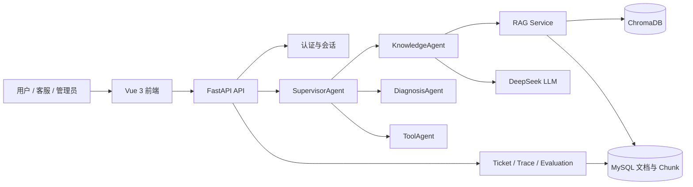

# Smart Hardware AI Customer Service Agent Platform

面向 DIY 电脑硬件售前售后的 AI 客服 Agent 平台原型。项目以真实硬件说明书为知识来源，将问题路由、RAG 检索、故障诊断、兼容性工具、人工工单、执行追踪和质量评估整合为一套可本地运行的演示系统。

## 技术栈

- 前端：Vue 3、Vite、Element Plus
- 后端：Python、FastAPI、SQLAlchemy、Pydantic
- 数据库：MySQL 8
- RAG：ChromaDB、sentence-transformers、PDF 文档切片
- 大模型：DeepSeek Chat（通过 `LLM_API_KEY` 配置）
- 测试：pytest

## 项目亮点

- 多 Agent 路由：根据问题类型分配知识问答、故障诊断或兼容性工具
- 可追溯 RAG：回答保留来源类型、文档、页码、Chunk 和 Trace 信息
- 人机协同闭环：AI 低置信度或用户主动请求时转人工工单
- 可评估工程链路：内置路由、检索、工具调用与失败用例质量指标
- 可信来源分层：官方说明书结论优先，社区经验只作为风险提示

## 核心功能

- AI Chat：统一用户入口、历史会话、示例问题和分阶段加载状态
- SupervisorAgent：识别产品知识、故障诊断、硬件兼容性与通用问题
- KnowledgeAgent / RAG：从官方说明书检索依据并生成带来源回答
- DiagnosisAgent：生成结构化硬件故障排查步骤
- ToolAgent：调用本地硬件兼容性工具
- Knowledge Center：查看说明书、Chunk、Embedding 状态与检索结果
- Ticket：AI 建议或用户主动触发人工工单，客服可回复和更新状态
- Agent Trace：查看路由、Agent、RAG、Tool、耗时与转人工信号
- Evaluation：查看回归测试用例和质量指标
- RBAC：普通用户、客服和管理员三种演示角色

## 系统架构



## 本地启动

### 1. 环境要求

- Python 3.12（推荐；3.11 也可）
- Node.js 20 LTS
- MySQL 8.0

先创建数据库：

```sql
CREATE DATABASE smart_agent CHARACTER SET utf8mb4 COLLATE utf8mb4_unicode_ci;
```

### 2. 一键安装依赖（Windows）

```powershell
.\setup_windows.bat
```

该脚本会创建项目内 Python 虚拟环境、安装后端和前端依赖，并在缺失时生成 `backend/.env`。

### 3. 配置后端

在仓库根目录执行：

```powershell
Copy-Item .env.example backend/.env
cd backend
python -m venv .venv
.\.venv\Scripts\Activate.ps1
pip install -r requirements.txt
```

编辑 `backend/.env`，至少确认 MySQL 连接参数；演示知识问答时还需要填写 `LLM_API_KEY`。

### 4. 启动服务

Windows 可分别双击：

- `start_backend.bat`：启动 FastAPI，默认地址 `http://127.0.0.1:8000`
- `start_frontend.bat`：启动 Vite，默认地址 `http://localhost:5173`

也可以手动启动：

```powershell
# 终端 1
cd backend
.\.venv\Scripts\python.exe -m uvicorn app.main:app --reload

# 终端 2
cd frontend
npm ci
npm run dev
```

- 健康检查：`http://127.0.0.1:8000/health`
- 接口文档：`http://127.0.0.1:8000/docs`

## Demo 账号

登录页提供一键初始化和登录，仅在 `APP_ENV=development` 时可用。

| 角色 | 用户名 | 密码 | 主要入口 |
| --- | --- | --- | --- |
| 普通用户 | `user_demo` | `123456` | AI Chat、创建人工工单 |
| 客服 | `agent_demo` | `123456` | Customer Service 工单中心 |
| 管理员 | `admin_demo` | `123456` | Knowledge、Agent、Trace、Evaluation、Ticket |

## 测试与构建

```powershell
cd frontend
npm run build

cd ..\backend
python -m pytest -q
```

完整演示步骤见 [`docs/DEMO_SCRIPT.md`](docs/DEMO_SCRIPT.md)。

### 发布前验证结果（2026-08-26）

| 项目 | 结果 |
| --- | --- |
| 前端生产构建 | `npm run build` 成功 |
| 后端测试 | `179 passed, 1 warning in 77.96s` |
| 高置信密钥扫描 | 待提交文件未发现密钥 |

pytest 的 1 条 warning 来自 FastAPI TestClient 依赖的弃用提示，不影响本阶段功能与测试结果。Phase 7.2 已完成示例问题、Knowledge、Ticket、Trace 等浏览器关键流程验收；详见演示脚本。前端主 JS Chunk 后续可通过按路由拆包继续优化。

### Phase 7.3：Knowledge Expansion Pipeline & Cooling Compatibility Polish

- Manual Seed 支持基于 `file_hash`、`file_url`、`support_url` 和原始文件名的增量幂等导入；不会重新下载或修改原始 PDF。
- 新增管理员接口 `GET /api/knowledge/manual-seed-status`，统计 manifest、官方说明书文档、Embedding、Chunk 和产品分类状态。
- Knowledge Center 新增 “Manual Seed Dataset” 轻量统计卡片和 “Import New Manuals” 操作。
- `pc_build_compatibility_tool` 新增冷排位置、前置冷排显卡限长、顶部净空、冷排厚度、风冷限高和内存避让判断。
- 规格缺失时返回 `unknown` 和 `missing_info`，不推测真实产品参数。
- 详细流程见 [`docs/KNOWLEDGE_EXPANSION_PIPELINE.md`](docs/KNOWLEDGE_EXPANSION_PIPELINE.md)。

### Phase 7.4：Community Experience Seed Dataset Integration

- 将 26 条、10 个主题的社区装机经验作为独立的 `community_experience` 提示层接入 Knowledge Center 和 RAG。
- 导入脚本按 `file_hash` 幂等去重，始终写入 `verified=false`，不修改 Hermes 原始 Markdown 和 manifest。
- RAG 和 Trace 保留 `source_type`，界面区分“官方说明书依据”和“社区经验提示”。
- ToolAgent 的确定性规则与官方说明书结论始终优先；社区经验只补充空间、走线、风道和观感风险。
- 使用社区来源的回答会强制显示“社区经验仅作为装机风险提示，不代表官方规格结论。”
- 数据说明与 usage policy 见 [`docs/COMMUNITY_EXPERIENCE_DATASET.md`](docs/COMMUNITY_EXPERIENCE_DATASET.md)。

## 数据与开源说明

`.gitignore` 会忽略 `.env`、构建产物、依赖目录、上传文件、向量库、日志和本地说明书。忽略规则只影响 Git 提交，不会删除本地的 PDF、`uploads` 或 `vector_store`。

- GitHub Desktop 发布步骤：[`docs/GITHUB_DESKTOP_PUBLISH.md`](docs/GITHUB_DESKTOP_PUBLISH.md)
- 卖电脑前备份与新电脑恢复：[`docs/NEW_COMPUTER_SETUP.md`](docs/NEW_COMPUTER_SETUP.md)

## 当前限制

- 当前 LLM Provider 仅实现 DeepSeek，知识问答需要可用的 API Key 和网络。
- 后端启动依赖可连接的 MySQL；暂未提供容器化一键编排。
- RAG 效果受本地已导入说明书、切片和向量索引完整度影响。
- 硬件兼容性工具只覆盖当前本地结构化数据中的规则和型号。
- AI 回答为非流式响应，请求超时阈值默认为 65 秒。
- 当前是本地演示原型，未实现生产级密钥托管、限流、审计和高可用部署。
